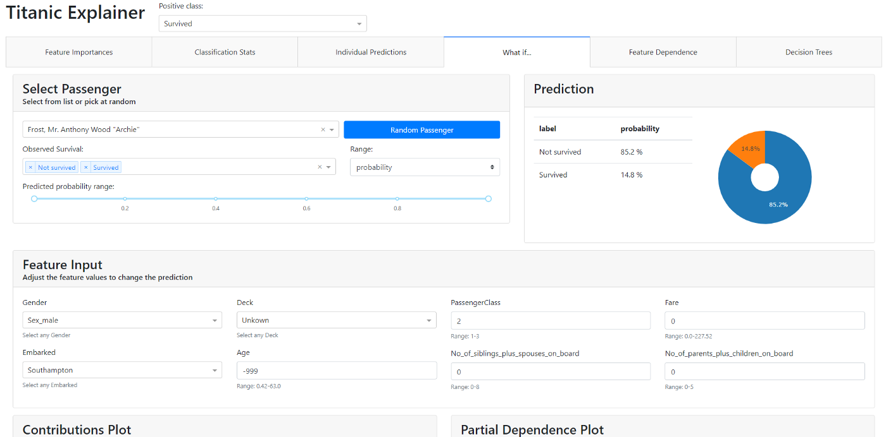
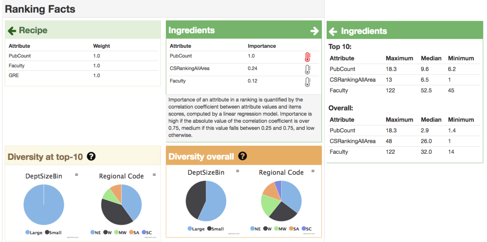

## Implement transparency into your algorithms
_Suggested time: 3 minutes_

In the case, of non-procured tools, nce you have identified all the algorithms within your organization, their stakeholders, the stakeholders’ goals, and created ideas on what transparency features would be ideal, it is finally time to implement them! This step mainly falls on the responsibility of the technical team, but also includes conversations with stakeholders for testing and feedback purposes.

> **Technical Guide**    The main contents of this course do not provide technical details for implementing transparency features. However, we have incldued a [short guide](https://dataresponsibly.github.io/algorithmic-transparency-playbook/technical-guide/) on transparency methods written for technical teams.

### Implement transparency features

Implementing transparency features is a technical process that may include creating data visualizations, building web or mobile dashboards for algorithms, or creating algorithmic factsheets.

Below we show two different examples of implemented transparency features:

The graphic above is a dashboard that shows the attribute influence for a particular individual. The left side of the dashboard labeled “Model Input” shows different characteristics about an individual like the bill amount (in dollars), the individual’s sex, and whether or not they are smoker. The right side of the graphic displays the top 5 attribute influences, and shows positive and negative influences on the algorithm’s output in green and red respectively.

The figure above shows a transparency label for an algorithm and comes from the tool RankingFacts. It shows the “recipe” for the algorithm (those attributes that are considered and their relative weights), as well additional information about the ingredients. This transparency label also shows measures related to the fairness of the algorithm, like how different subgroups are being classified.

> **DELIVERABLE:** Full implementations of transparency for your organization's algorithms.

### Test and review your transparency implementation with stakeholders

As mentioned earlier, there is no objective way of measuring whether or not transparency has been implemented properly. Instead, the quality of transparency is subjective and ultimately up to the stakeholders. To avoid the pitfalls of poorly implemented transparency features, you should consult with stakeholders to make sure that transparency features are implemented properly. We have included some design tips in the **Design Guide** of this playbook.

Some pitfalls of poorly implemented transparency include showing attribute importance and influence in a way that they are not human understandable, assuming that your stakeholders have the same knowledge as you or the technical team (ex. not everyone understands how to read a decision tree diagram), or designing global transparency when local transparency is needed, or vice-versa.

> **DELIVERABLE:** Refined implementations of transparency for your organization’s algorithms. You are nearing the finish line!